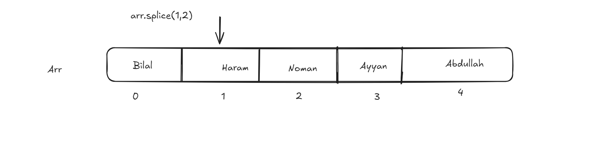

# Array

Collection of multiple types values store in single variables

## Todays Topics

- inserting and deleting items using index
- `arr.length` to find the total elements in array
- array methods
- `.push()` add one or multiple item in array at last and return updated length of array
- `.pop()` delete item in array at last and return deleted items
- `.unshift()` add one or multiple item in array from start and return updated length of array
- `.shift()` delete item in array from and return deleted items
- `.splice(start,delete count, new value)` use to add, remove and update array item. always return the array of deleted items
- `.slice()` to copy array items



## Exercise Question

**_Challenge_**

```javascript
// Challenge
var arr = ["Bilal", "Noman", "Abdullah"];
// result
// arr = ["Abdullah", "Noman", "Bilal"]
```

Please solve sheet question: pdf no 14-16
<a href="./../Exercise Questions/chapters14-16.pdf">Assignment Question</a>
